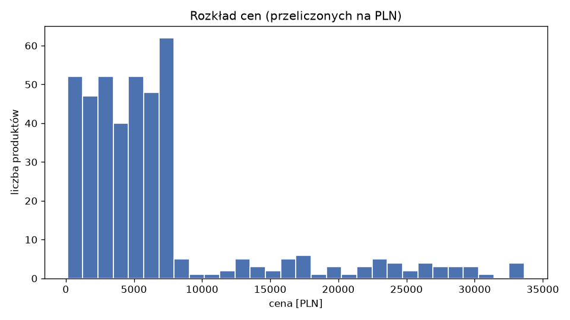
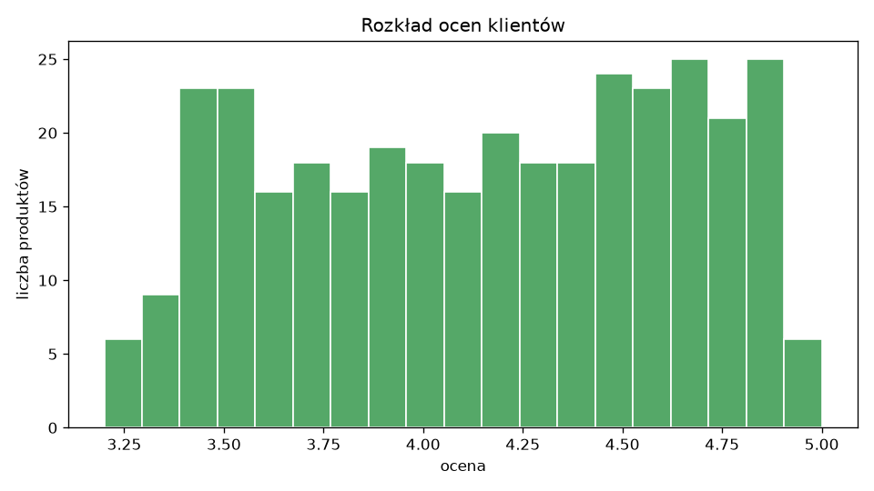
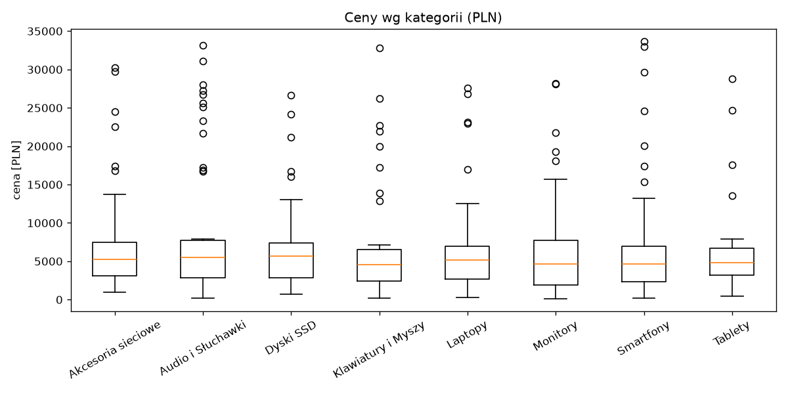
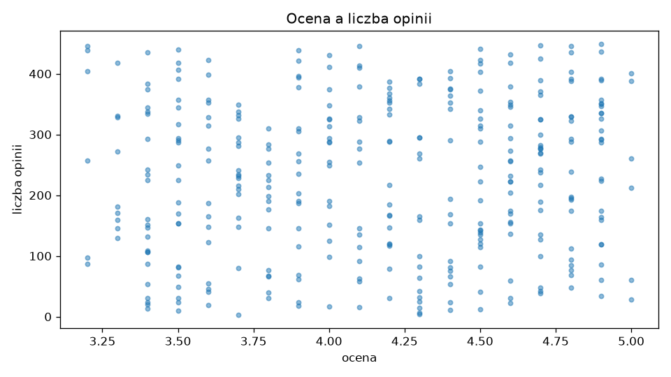
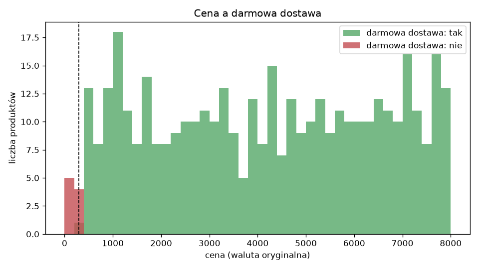

# Raport analizy danych – TechStore (Parser1)

Data parsowania: 2026-10-07, czas działania parsera: 1208 s (headless).

## 0. Surowy HTML a drzewo DOM

| źródło | elementy z data-id | unikalne id |
|---|---|---|
| surowy HTML (requests, bez JS) | 0 | 0 |
| DOM po wczytaniu strony (Selenium) | 50 | 50 |
| DOM po 9 × „Wczytaj więcej” | 2660 | 420 |

Kontrolnie: surowy HTML zawiera 10 nagłówków tabeli, więc parsowanie działa – rekordów brak, bo dodaje je dopiero JavaScript (app.js).

## 1. Kontrola jakości danych

- Liczba rekordów po czyszczeniu: **420**, liczba kolumn: **30**.

### Braki w kolumnach

| cecha | braki_szt | braki_% |
|---|---|---|
| gwarancja_miesiace | 158 | 37.6 |
| gwarancja | 91 | 21.7 |
| ocena | 76 | 18.1 |

Kolumny nieujęte w tabeli nie mają braków.

- `ocena` i `gwarancja`: braki zapisane w serwisie jako „Brak oceny” / „-” / „Brak informacji” (utrudnienie autora) – parser zamienił je na puste wartości.
- `gwarancja_miesiace` ma więcej braków niż `gwarancja`: oprócz 91 brakujących gwarancji jest 67 gwarancji „Dożywotnia producenta”, których nie da się wyrazić w miesiącach – to świadoma decyzja, nie błąd parsera.

### Duplikaty

| etap | rekordy | unikalne id |
|---|---|---|
| DOM po „Wczytaj więcej” (wszystkie elementy [data-id]) | 2660 | 420 |
| lista z 9 podstron (karty + tabela) | 430 | 420 |
| po usunięciu duplikatów | 420 | 420 |

Zduplikowane id w katalogu (10): 115 (strony [3, 9]), 165 (strony [4, 9]), 215 (strony [5, 9]), 25 (strony [1, 9]), 265 (strony [6, 9]), 315 (strony [7, 9]), 365 (strony [8, 9]), 405 (strony [9, 9]), 5 (strony [1, 9]), 65 (strony [2, 9]).

### Typy kolumn liczbowych

| cecha | typ | czy_liczbowa |
|---|---|---|
| cena | float64 | True |
| cena_pln | float64 | True |
| ocena | float64 | True |
| liczba_opinii | int64 | True |
| gwarancja_miesiace | float64 | True |
| waga_kg | float64 | True |

### Wartości odstające (reguła 1,5 × IQR)

| kolumna | dolna_granica | gorna_granica | odstajace_szt | min | max |
|---|---|---|---|---|---|
| cena | -4170.46 | 12449.38 | 0 | 121.40 | 7990.72 |
| cena_pln | -4703.14 | 14465.59 | 50 | 123.30 | 33647.84 |
| ocena | 2.35 | 5.95 | 0 | 3.20 | 5.00 |
| liczba_opinii | -370.62 | 726.38 | 0 | 0.00 | 449.00 |
| waga_kg | -1.96 | 6.38 | 0 | 0.15 | 4.50 |

Najdroższe produkty po przeliczeniu na PLN:

| id | nazwa | cena | waluta | cena_pln |
|---|---|---|---|---|
| 7 | Lenovo Nova 12 #7 | 7825.08 | EUR | 33647.84 |
| 189 | Lenovo Momentum 4 #189 | 7707.62 | EUR | 33142.77 |
| 416 | Logitech Pixel 8 Pro #416 | 7667.97 | EUR | 32972.27 |
| 404 | Dell MX Keys Mini #404 | 7624.90 | EUR | 32787.07 |
| 388 | Samsung AirPods Pro 2 #388 | 7765.05 | USD | 31060.20 |

**Interpretacja:** w walucie oryginalnej (`cena`) nie ma wartości odstających. Wszystkie wartości odstające `cena_pln` to produkty w EUR/USD (łącznie 86 szt.) po przeliczeniu kursem. To anomalia danych, a nie błąd parsera: generator serwisu losuje ceny z tego samego zakresu niezależnie od waluty, więc np. smartfon za 7825 EUR (ok. 33 tys. zł) jest nierealistyczny. Dlatego ceny analizowane są osobno w walucie oryginalnej i po przeliczeniu.

Kontrola błędu przecinka: maksymalna cena w walucie oryginalnej to 7990.72 (gdyby parser zgubił przecinek, ceny byłyby rzędu setek tysięcy).

## 2. Statystyki opisowe

| cecha | n | średnia | mediana | moda | Q1 | Q3 | min | max |
|---|---|---|---|---|---|---|---|---|
| cena | 420 | 4149.17 | 4218.35 | 121.40 | 2061.98 | 6216.94 | 121.40 | 7990.72 |
| cena_pln | 420 | 6734.44 | 4964.15 | 123.30 | 2485.13 | 7277.32 | 123.30 | 33647.84 |
| ocena | 344 | 4.16 | 4.20 | 4.70 | 3.70 | 4.60 | 3.20 | 5.00 |
| liczba_opinii | 420 | 186.32 | 176.00 | 0.00 | 40.75 | 315.00 | 0.00 | 449.00 |
| gwarancja_miesiace | 262 | 31.60 | 36.00 | 48.00 | 24.00 | 48.00 | 12.00 | 48.00 |
| waga_kg | 420 | 2.28 | 2.31 | 2.64 | 1.17 | 3.25 | 0.15 | 4.50 |

Moda cen jest mało informatywna – ceny są ciągłe i prawie każda występuje raz, więc moda to po prostu najmniejsza wartość. Średnia `cena_pln` jest wyraźnie wyższa od mediany przez ceny w EUR/USD (rozkład prawoskośny).

### Rozkłady kategoryczne

**kategoria**

| kategoria | liczba |
|---|---|
| Audio i Słuchawki | 59 |
| Laptopy | 58 |
| Dyski SSD | 55 |
| Monitory | 54 |
| Klawiatury i Myszy | 50 |
| Smartfony | 49 |
| Tablety | 48 |
| Akcesoria sieciowe | 47 |

**waluta**

| waluta | liczba |
|---|---|
| PLN | 334 |
| USD | 44 |
| EUR | 42 |

**dostepnosc**

| dostepnosc | liczba |
|---|---|
| Dostępny w salonie | 90 |
| Dostępny na zamówienie | 84 |
| Wysyłka w 24h | 84 |
| Ostatnie 3 sztuki | 83 |
| W magazynie | 79 |

**stan**

| stan | liczba |
|---|---|
| Powystawowy | 151 |
| Odnowiony przez producenta | 142 |
| Nowy | 127 |

## 3. Wykresy

### Histogram cen

### Histogram ocen

### Wykres pudełkowy cen wg kategorii

### Ocena a liczba opinii

### Cena a darmowa dostawa

## 4. Korelacje

### Pearson

| cecha | cena_pln | ocena | liczba_opinii | gwarancja_miesiace | waga_kg | darmowa_dostawa_int |
|---|---|---|---|---|---|---|
| cena_pln | 1.00 | -0.12 | 0.01 | -0.02 | -0.02 | 0.14 |
| ocena | -0.12 | 1.00 | 0.07 | -0.01 | 0.01 | 0.10 |
| liczba_opinii | 0.01 | 0.07 | 1.00 | 0.04 | 0.01 | -0.00 |
| gwarancja_miesiace | -0.02 | -0.01 | 0.04 | 1.00 | 0.12 | 0.06 |
| waga_kg | -0.02 | 0.01 | 0.01 | 0.12 | 1.00 | 0.04 |
| darmowa_dostawa_int | 0.14 | 0.10 | -0.00 | 0.06 | 0.04 | 1.00 |

### Spearman

| cecha | cena_pln | ocena | liczba_opinii | gwarancja_miesiace | waga_kg | darmowa_dostawa_int |
|---|---|---|---|---|---|---|
| cena_pln | 1.00 | -0.08 | -0.06 | 0.02 | -0.02 | 0.25 |
| ocena | -0.08 | 1.00 | 0.08 | -0.00 | 0.00 | 0.10 |
| liczba_opinii | -0.06 | 0.08 | 1.00 | 0.04 | 0.01 | -0.00 |
| gwarancja_miesiace | 0.02 | -0.00 | 0.04 | 1.00 | 0.12 | 0.06 |
| waga_kg | -0.02 | 0.00 | 0.01 | 0.12 | 1.00 | 0.04 |
| darmowa_dostawa_int | 0.25 | 0.10 | -0.00 | 0.06 | 0.04 | 1.00 |

### Komentarz

- **cena ↔ darmowa dostawa**: współczynnik jest niski (Spearman 0.25), choć zależność jest pełna: reguła „darmowa dostawa, gdy cena > 300” zgadza się w 100.0% rekordów. Zależność jest progowa, a produktów tańszych niż 300 jest tylko 9, więc korelacja (miara zależności liniowej / monotonicznej w całym zakresie) jej nie oddaje. Ma ona sens merytoryczny – to typowa polityka sklepu.
- **ocena ↔ liczba opinii** (tylko produkty z oceną, n=344): Pearson 0.07 – brak zależności. W prawdziwym sklepie można by oczekiwać słabej dodatniej korelacji; tu dane są fikcyjne i losowane niezależnie.
- **cena ↔ waga**: Pearson -0.02 – brak zależności, co jest podejrzane merytorycznie (np. laptopy są i cięższe, i droższe od akcesoriów), ale wynika z losowego generatora danych.
- Pozostałe pary mają współczynniki bliskie zera – cechy są w danych niezależne.